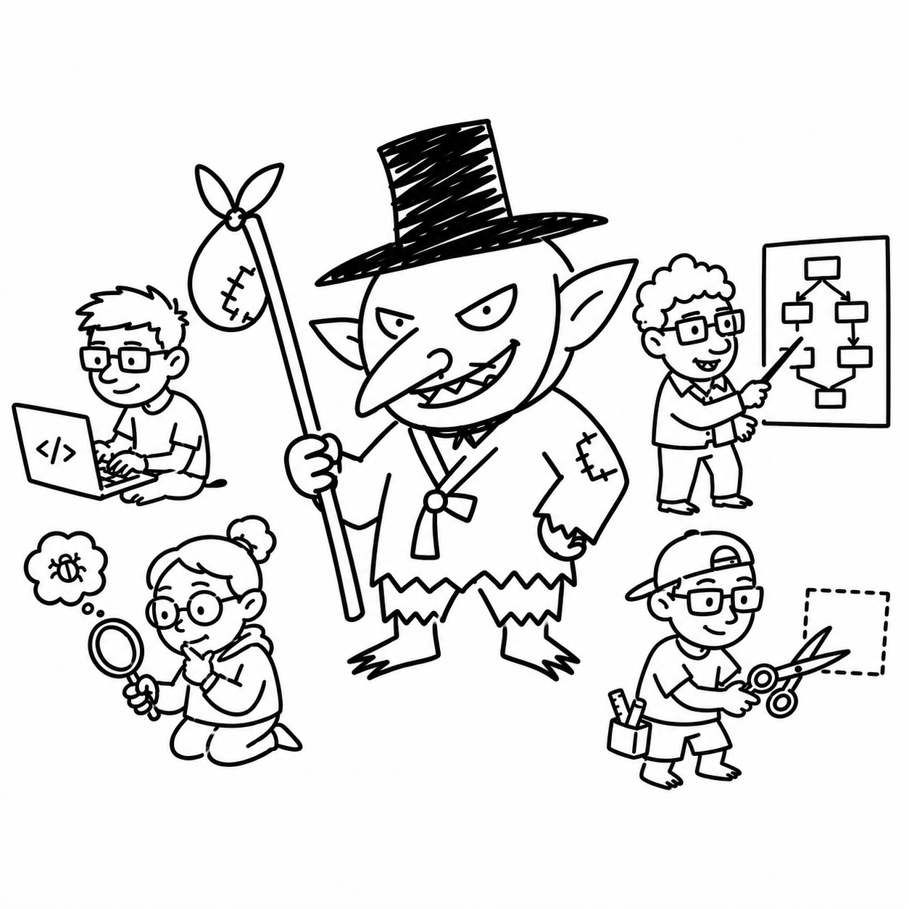

# Gooblin

<p align="center">
  
</p>

<p align="center">
  <strong>Your agent has ideas. Gooblin has scissors.</strong><br>
  A geeky product-engineering team for AI coding agents.<br>
  <em>Less nonsense. More shippable code.</em>
</p>

<p align="center">
  
  
  
  
  
</p>

Gooblin is an open-source plugin-style Agent Skills pack. It is not an app, runtime, framework, cloud agent, messaging bot, or general-purpose npm runtime.

Website: [jsleemaster.github.io/gooblin](https://jsleemaster.github.io/gooblin/).

It installs where compatible agents support plugins. It still works as plain Markdown when they do not.

## Intentionally Small

Gooblin is not a full software-development lifecycle framework.

It does not replace deep planning, TDD, systematic debugging, code review, or release engineering systems. It sits before them as a lightweight engineering judgment gate:

- Is this overbuilt?
- Are we guessing?
- Did we reproduce it?
- Is this abstraction paying rent?
- What can we defer?
- What proves the change?

Use Gooblin when a full workflow is too much, but raw agent momentum is too risky.

Gooblin stays small because the job is narrow: stop overbuilding before it reaches the repo.

## The Goblin In The Room

You know him. Tall hat. Bad grin. Worse patience.

He watches your agent add a helper for one condition, draw a service layer around one setting, and redesign the roadmap to fix a button.

Then he calls the team.

Gooblin is not here to make your agent louder.
It is here to make your agent answer to a practical engineering room before it touches the repo.

## Before / After

User asks for a small settings change.

| Before Gooblin | With Gooblin |
| --- | --- |
| Adds a new helper for one condition. | The Clipper checks whether existing code already covers it. |
| Creates a service layer around one setting. | Ground Control rejects the abstraction until it pays rent. |
| Fixes based on a guess. | Rubber Duck separates expected behavior from actual behavior. |
| Starts redesigning the settings flow. | Yak Shaver cuts anything outside the requested change. |
| Calls it done without proof. | The change ships with verification. |

The point is not fewer lines. The point is fewer unnecessary decisions.

## The Team

| Teammate | Job | Belief |
| --- | --- | --- |
| **The Clipper** | Minimal-code senior engineer who cuts unnecessary code, dependencies, rewrites, and abstractions. | Smallest safe change wins. |
| **Ground Control** | Anti-Architecture-Astronaut product architect. | Every abstraction must pay rent. |
| **Rubber Duck** | Debugging coach and contradiction finder. | Do not fix what you have not reproduced. |
| **Yak Shaver** | Scope cutter and delivery PM. | If it does not unblock the goal, defer it. |

## How It Works

You do not need to pick a teammate.

Start with `/gooblin`. The router decides whether the task needs a cutter, architect, debugger, scope guard, shipcheck, or the full council.

Before writing code, `/gooblin` diagnoses the task type and routes to the smallest useful teammate set.

Gooblin Router:

- Code bloat, dependencies, rewrites, or smallest safe implementation: The Clipper.
- Architecture, module boundaries, abstractions, scalability, or system design: Ground Control.
- Bugs, failing tests, unexpected behavior, unclear cause, or reproduction: Rubber Duck.
- MVP, scope, deadlines, task breakdown, roadmap, or rabbit holes: Yak Shaver.
- Pre-merge, pre-release, or final review: Shipcheck using all four perspectives.
- Ambiguous or high-risk work: full Gooblin Council.

Then Gooblin uses this ladder:

1. What is the actual product goal?
2. What is the expected behavior?
3. What is the smallest safe change?
4. Does existing code already solve it?
5. Can native platform or stdlib solve it?
6. Is this abstraction paying rent?
7. Has the bug been reproduced?
8. What scope can be deferred?
9. What verifies the change?

Gooblin is lazy about unnecessary work, not lazy about understanding the problem.

Never cut: auth/authz, validation, secrets handling, data-loss protection, rollback paths, accessibility basics, or user-stated constraints.

## Install

Gooblin is designed to be installed like a plugin-style Agent Skills pack.

### Claude Code

```bash
/plugin marketplace add jsleemaster/gooblin
/plugin install gooblin@gooblin
```

You may need to send those as two separate prompts.

### Codex

```bash
codex plugin marketplace add jsleemaster/gooblin
codex plugin add gooblin@gooblin
codex
```

You can also open `/plugins`, select the Gooblin marketplace, install Gooblin, review hooks if prompted, and start a new thread.

### npx skill-pack installer

For agents without plugin marketplace support, npx can copy Gooblin into the current repo as a readable skill pack:

```bash
npx gooblin install
```

Current status:

- Source package version `gooblin@1.3.2` contains the destructive-operation refusal guard.
- Before using registry lifecycle commands, run `npx --yes gooblin --version`. Version 1.3.1 does not contain the guard; use those commands only after the resolved version is 1.3.2 or newer.

Repository-source fallback:

```bash
npx github:jsleemaster/gooblin install
```

The 1.3.2 source installer writes `.gooblin/` in the target project. It does not enable hooks, edit host settings, access the network, or collect telemetry. Use `--dry-run`, `--target <dir>`, and `status` to inspect the copy. Until ownership manifests are implemented in [#49](https://github.com/jsleemaster/gooblin/issues/49), version 1.3.2 and newer refuse `--force` replacement and `uninstall`. Version 1.3.1 does **not** contain that guard; verify the resolved version before using registry lifecycle commands.

### Manual fallback

If your agent does not support plugins yet, copy or reference:

- `AGENTS.md`
- `skills/`
- `commands/`

Then ask your coding agent:

```text
Use /gooblin for this task. Diagnose the task type first, then route to the smallest useful teammate set.
```

Plugin support may vary by agent. If plugin installation is not available, Gooblin still works as a readable skill pack.

Hooks are optional. They only inject Gooblin context and should never mutate user files automatically.

See [install docs](docs/install.md) and [compatibility notes](docs/compatibility.md) for currently verified local installer behavior.
Optional host recipes for Codex, Claude Code, Gemini CLI, OpenCode, Devin, Hermes Agent, Cursor, Continue-style context, and generic agents live in [adapters](adapters/).
Status, configuration, uninstall, and statusline recipes live in [operations](docs/operations.md).
Stable surfaces and claim rules are documented in [stability](docs/stability.md), [verified install paths](docs/verified-install-paths.md), and [claims policy](docs/claims-policy.md).

## Commands

Most users should start with `/gooblin`.

The character commands are direct-call shortcuts for users who already know which review mode they want.

| Command | What it does |
| --- | --- |
| `/gooblin` | Primary interface. Start here; it diagnoses the task and routes to the smallest useful teammate set. |
| `/clip` | Advanced shortcut: The Clipper only, for code, dependencies, rewrites, and unnecessary abstractions. |
| `/ground` | Advanced shortcut: Ground Control only, for architecture and product fit. |
| `/duck` | Advanced shortcut: Rubber Duck only, for debugging, reproduction, and contradiction finding. |
| `/yak` | Advanced shortcut: Yak Shaver only, for scope control and next shippable move. |
| `/shipcheck` | Advanced shortcut: final working-tree, branch, or release review before calling work done. |

In some agents, commands may be exposed as skills instead of slash commands.

## Examples

| Example | What it catches |
| --- | --- |
| [Overbuilt date picker](examples/overbuilt-date-picker/) | Dependency and wrapper creep. |
| [Architecture astronauting](examples/architecture-astronauting/) | Plugin platforms, event buses, and service layers before need. |
| [Debugging without reproduction](examples/debugging-without-repro/) | Fixing before expected/actual/repro are clear. |
| [Yak-shaving an MVP](examples/yak-shaving-mvp/) | Redesigning the system before shipping the page. |
| [Unsafe auth shortcut](examples/unsafe-auth-shortcut/) | Over-cutting past the safety floor. |
| [Plugin install verification](examples/plugin-install-verification/) | Separating verified install facts from assumptions. |
| [Release train governance](examples/release-train-governance/) | Shipping fast without pretending review happened. |
| [Claims policy review](examples/claims-policy-review/) | Cutting unsupported safety, speed, and compatibility claims. |

These examples are not benchmarks.

## Numbers

No benchmark claims yet.

Early pilot signal: Gooblin scored +4 on the architecture/scope-risk task in a 4-task GitHub Models pilot, improving scope control, dependency discipline, debugging discipline, and verification quality. It tied baseline on three already-scoped review/planning tasks.

Gooblin will not claim "less code," "faster," "cheaper," or "safer" until measured on real agentic coding sessions.

Planned measurements:

| Metric | Why it matters |
| --- | --- |
| diff size | Catches unnecessary churn. |
| dependency additions avoided | Tracks native/platform reuse. |
| tests added | Checks behavior changes are verified. |
| scope reduced | Measures avoided rabbit holes. |
| verification quality | Separates confidence from proof. |
| safety regressions | Makes sure cutting did not cut the floor. |

If benchmarks are added later, include method, repo/task set, model/agent version, sample size, limitations, and reproduction instructions.

Evaluation guidance lives in [benchmarking](docs/benchmarking.md). Eval fixtures live in [evals/fixtures](evals/fixtures/). They are behavior checks, not benchmarks.

## Development

This repo should stay boring.

- Keep skills readable as plain Markdown.
- Keep hooks tiny and dependency-free.
- Keep plugin manifests aligned.
- Update examples when behavior changes.
- Run `npm run validate` before release.
- Use [maintenance guardrails](docs/maintenance.md) when a change touches public behavior, distribution, examples, or release metadata.
- Do not add runtime scaffolding unless explicitly needed.
- Do not add fake automation.

`package.json` exists only as minimal open-source plugin metadata and installer metadata. Do not add app dependencies, build tooling, or runtime scaffolding.

## FAQ

**Q: Is Gooblin an agent runtime?**

A: No. It is a plugin-style Agent Skills pack.

**Q: Is Gooblin a full workflow system?**

A: No. It is a lightweight engineering judgment gate. Use deeper planning, TDD, debugging, or review systems when the work needs them.

**Q: Does it write code for me?**

A: Your coding agent writes code. Gooblin makes it harder for the agent to overbuild, guess, or drift.

**Q: Are the four teammates actual subagents?**

A: Not by default. They are skills and review modes. Future adapters may map them to subagents where supported.

**Q: Does Gooblin need hooks?**

A: No. Hooks improve activation in compatible agents. The skills still work as plain Markdown.

**Q: Does Gooblin only work in English?**

A: No. Gooblin should answer in the user's language by default while keeping code, commands, paths, API names, and error text intact.

**Q: Why "Gooblin"?**

A: Because your agent needed adult supervision and got a goblin with scissors.

## License

MIT.
Small enough to ship.
